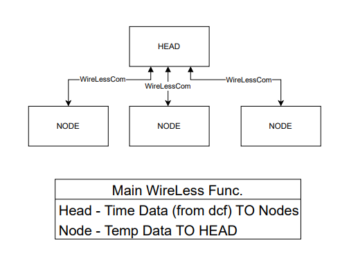
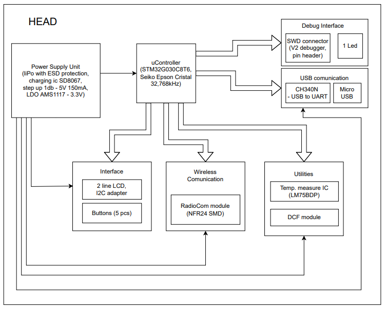
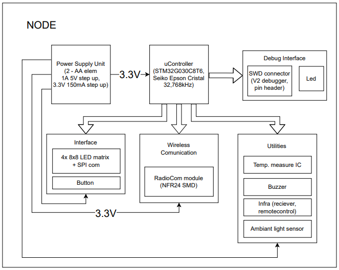
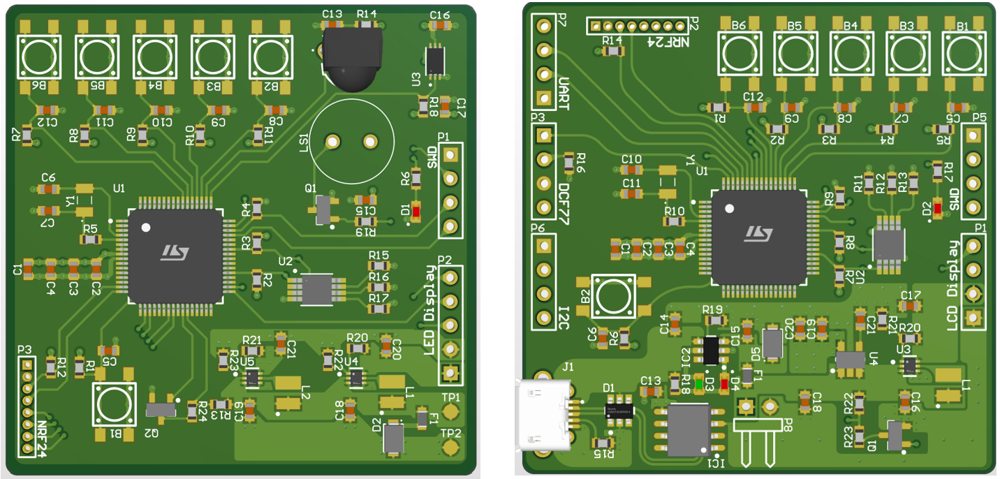

# IntelligentWallClockDesign

M. Sc. Univercity project.
	
The project's objective was to design two PCBs with Altium Designer, the HEAD (control PCB) and the NODE (the wall clock's).

The HEAD get the exact time via DCF77, from the atomic clock in Nuremberg (compatible with other DCF products too), then send this to the NODE-s with NRF 24 (commonly used radio transceiver). There is extra SPI and I2C communication interface too, if some one doesn't like DCF protocol.
It can also set alarm's, and get temperature data from NODE-s. And it has a PC connection with USB, which can charge this device's accumulator too.

The NODEs are equipped, with a Buzzer (for alarms), a temperature sensor and also with an ambient light sensor. These wall clocks can be controlled by remote control (or buttons), and have a 8 x 32 pixel wide LED panel (3.2 cm x 12.8 cm). This device works with two AA battery.

These PCBs are STM 32 (Arm cortex M0+) based and have a compact 4 layer's design for circuit integrity. Size: 50 mm X 50 mm. The project have a more detailed Hungarian documentation too.

The right is the NODE, the left one is the HEAD PCB's 3D modell.